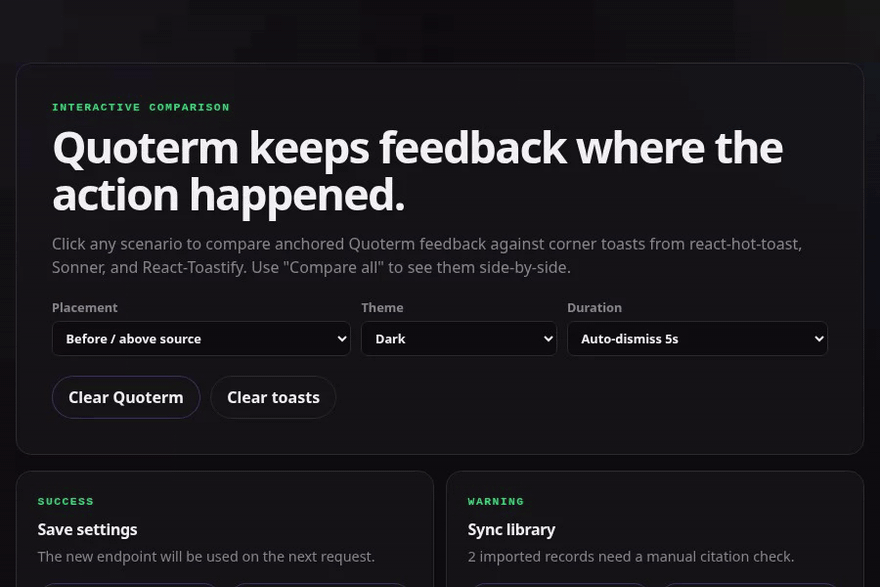
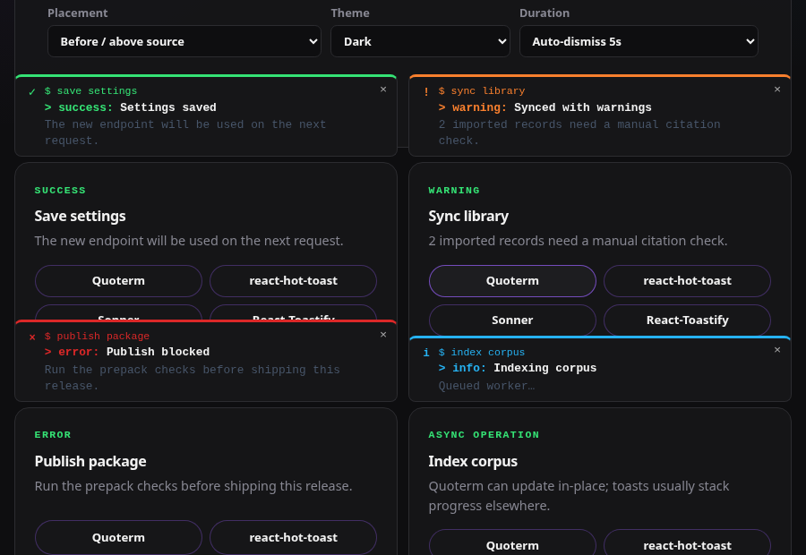
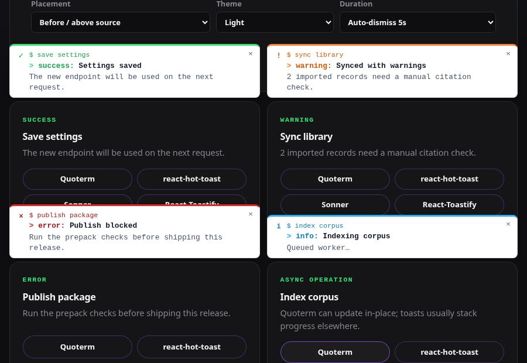
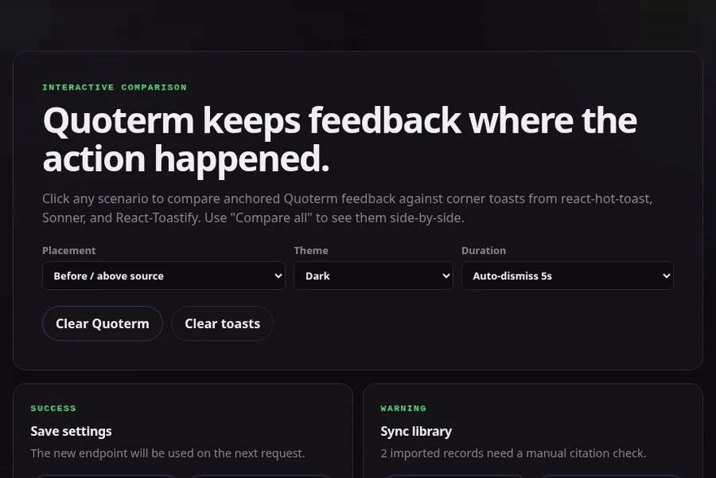

# Quoterm

[](https://www.npmjs.com/package/quoterm)
[](LICENSE)
[](https://www.typescriptlang.org/)
[](https://react.dev/)

Quoted terminal-style contextual feedback for React — a compact alternative to detached toast popups.

Quoterm is for messages that should stay near the thing they explain: CLI-style command results, form feedback, generated citations, background task status, import warnings, and other “this happened here” UI moments. Toasts float away from context; with a `source` element, Quoterm can render either a fixed-position overlay anchored to that element with no layout shift, or true inline feedback inserted into document flow before or after the source.

## Installation

```sh
npm install quoterm
```

```tsx
import { QuotermHost, quoterm } from 'quoterm';
import 'quoterm/style.css';
```

`quoterm/styles.css` is also exported as a compatibility alias.

## Quick start

Render one host near the root of your app, then trigger feedback from actions, command panels, forms, or async tasks.

```tsx
import { QuotermHost, quoterm } from 'quoterm';
import 'quoterm/style.css';

export function App() {
  return (
    <>
      <button
        onClick={(event) => {
          quoterm({
            source: event.currentTarget,
            variant: 'success',
            command: 'save settings',
            title: 'Saved',
            message: 'The new API key will be used on the next request.',
          });
        }}
      >
        Save settings
      </button>
      <QuotermHost />
    </>
  );
}
```

## Visual examples

### Feedback anchored to the source — overlay mode



By default, each banner appears as a fixed overlay above (or below) the element that triggered it. No toasts, no layout shift, no detached corners — the feedback stays where the action happened.

### All four variants



Variants in dark mode. The same four variants in light mode:



### Quoterm versus corner toasts



The Quoterm banner appears anchored to the card that triggered it (top border, spanning full card width). The corner toasts from react-hot-toast (top-right), Sonner, and React-Toastify (bottom) float detached from context.

A runnable interactive comparison lives in [`examples/comparison`](examples/comparison/README.md) — click "Quoterm", "react-hot-toast", "Sonner", "React-Toastify", or "Compare all" per scenario. Controls let you tune placement, theme, and duration without touching source.

```sh
cd examples/comparison
npm install
npm run dev
```

## API

### `quoterm(input)`

Creates or replaces a feedback item and returns controls for that item.

```ts
type QuotermVariant = 'success' | 'warning' | 'error' | 'info';
type QuotermPlacement = 'auto' | 'top' | 'bottom' | 'before' | 'after' | 'above' | 'below';
type QuotermTheme = 'light' | 'dark' | 'auto';
type QuotermSource = EventTarget | Element | React.RefObject<Element | null> | DOMRect | null;
type QuotermRenderMode = 'overlay' | 'inline';

interface QuotermInput {
  id?: string;
  title?: React.ReactNode;
  message?: React.ReactNode;
  description?: React.ReactNode;
  variant?: QuotermVariant;
  /** Overrides the host theme for this item. */
  theme?: QuotermTheme;
  command?: string;
  source?: QuotermSource;
  sourceRect?: DOMRect | null;
  /** Positive ms auto-dismisses; null or 0 persists. Undefined uses the variant default. */
  duration?: number | null;
  className?: string;
  /** Optional per-item minimum width for source-bound and fallback feedback. */
  minWidth?: number;
  style?: React.CSSProperties;
  dismissLabel?: string;
  placement?: QuotermPlacement;
  role?: 'status' | 'alert';
  ariaLive?: 'off' | 'polite' | 'assertive';
}
```

### `QuotermHost(props)`

Renders active feedback. When an item has a source element, the host uses `renderMode` to decide how it should attach to that source. Add one host per app or per bounded surface.

```ts
interface QuotermHostProps {
  className?: string;
  maxItems?: number;
  gutter?: number;
  maxWidth?: number;
  /** Shorthand for inlineWidth.min; defaults to 280. */
  minWidth?: number;
  inlineWidth?: {
    min?: number;
    max?: number;
    /** Multiplies the source width before clamping; defaults to 2.5. */
    sourceScale?: number;
  };
  zIndex?: number;
  /** Defaults to 'auto', following prefers-color-scheme. */
  theme?: QuotermTheme;
  /** Defaults to 'overlay' for backward-compatible fixed anchored feedback. */
  renderMode?: QuotermRenderMode;
  /** Set false to hide `$ command`, `>`, and severity prefix chrome. */
  showCommandChrome?: boolean;
  portalTarget?: Element | DocumentFragment | null;
  renderIcon?: (variant: QuotermVariant) => React.ReactNode;
  formatCommand?: (variant: QuotermVariant, item: QuotermState) => string;
}
```

Other exports: `useQuoterm`, `dismissQuoterm`, `getQuotermsSnapshot`, and public TypeScript types.

## Variants

- `success` — completed actions.
- `warning` — recoverable issues or caveats.
- `error` — failed actions.
- `info` — neutral progress, hints, generated output.

```tsx
quoterm({ variant: 'warning', title: 'Token expires in 5 minutes.' });
quoterm({ variant: 'error', title: 'Build failed', message: 'Check stderr above.' });
```

Warnings and errors default to `role="alert"` and assertive announcements. Success and info default to `role="status"` and polite announcements.

## Anchoring and fallback placement

Pass `source` or a React ref to insert feedback next to the UI element that caused it. `sourceRect` is accepted for fallback-only cases where no element exists.

```tsx
quoterm({
  source: buttonRef,
  placement: 'after', // aliases: 'bottom' / 'below'; default is before/above
  command: 'npm run build',
  title: '2 warnings, 0 errors',
});
```

Quoterm keeps live element references when possible. By default, `<QuotermHost />` uses `renderMode="overlay"`: source-bound feedback is portaled to the page, positioned with `position: fixed`, and anchored just above or below the source without moving layout. Set `placement: 'after'`, `'bottom'`, or `'below'` to anchor it below the source; `placement: 'before'`, `'top'`, `'above'`, and `'auto'` preserve the default before/above behavior.

Use `<QuotermHost renderMode="inline" />` when feedback should become part of the component layout. In inline mode, Quoterm creates a real DOM slot immediately before/above the source element by default, or immediately after/below it for `placement: 'after'`, `'bottom'`, or `'below'`. The slot does not use fixed positioning, viewport `left`/`top`, or overlay stacking, so surrounding content can move naturally around the feedback.

Both source-bound modes avoid tiny button-width banners: the host starts from the source width, applies `inlineWidth.sourceScale` (default `2.5`), then clamps between `inlineWidth.min` / `minWidth` (default `280`) and `inlineWidth.max` / `maxWidth` (default `360`) without overflowing the viewport gutter. Individual calls can override the minimum with `quoterm({ minWidth: 320, ... })`; hosts can tune the policy with `<QuotermHost inlineWidth={{ min: 280, max: 420, sourceScale: 2.5 }} />`. If no source element is available, it falls back to a minimal fixed quote near the upper right of the viewport.

Set `<QuotermHost showCommandChrome={false} />` when the host application should provide feedback without terminal chrome. The item still renders its icon, title, message, description, role, and aria-live behavior, but omits `$ command`, the `>` prompt, and the visible severity prefix such as `error:`.

## Dismissal and duration

```tsx
const defaultSuccess = quoterm({ variant: 'success', title: 'Saved' }); // fades after 4s
const persistent = quoterm({ title: 'Fix the highlighted field', duration: 0 });
const alsoPersistent = quoterm({ variant: 'warning', title: 'Review this warning' });
const timed = quoterm({ title: 'Index refresh queued', duration: 6000 });

timed.update({ message: 'Worker accepted the job.' });
persistent.dismiss();

dismissQuoterm(); // dismiss all
```

`duration` is variant-aware by default: success auto-dismisses after 4 seconds and info after 6 seconds. Warnings and errors persist until the close button or returned `dismiss()` handler is used. Pass a positive number to override the timeout, or pass `null` / `0` to force any variant to persist.

## Themes and styling customization

`QuotermHost` accepts `theme="auto" | "light" | "dark"`. The default is `auto`, which follows `prefers-color-scheme`; pass `theme="light"` for demos or product surfaces that should stay light. Individual calls can override the host with `quoterm({ theme: 'dark', ... })`. Severity accents stay vivid in both light and dark themes.

Import the default stylesheet:

```tsx
import 'quoterm/style.css';
```

Then override classes or CSS variables:

```css
.my-feedback {
  --quoterm-fg: #111827;
  --quoterm-muted: #7c3aed;
  --quoterm-border: #8b5cf6;
}
```

```tsx
quoterm({ className: 'my-feedback', title: 'Queued for review' });
```

The package marks CSS as a side effect so bundlers do not accidentally tree-shake `style.css` / `styles.css`. JavaScript modules remain tree-shakeable.

## Accessibility

- `success` and `info` default to `role="status"` and `aria-live="polite"`.
- `warning` and `error` default to `role="alert"` and `aria-live="assertive"`.
- Dismiss buttons include a configurable accessible label.
- `aria-atomic="true"` is applied to each feedback item.
- Source-bound feedback defaults to fixed overlay anchoring for no-layout-shift status messages.
- Use `renderMode="inline"` when assistive context should be inserted immediately before/above or after/below its source in document flow.
- Keep message text concise and actionable; do not use Quoterm for long logs.

## Why not a toast?

Use a toast when the message is global, disposable, and unrelated to the current focus. Use Quoterm when the feedback has a source: a command, field, quote, citation, generated block, file, or action result. It is intentionally quieter, more inspectable, and less prone to stealing attention.

## Package decisions

- Package name: `quoterm`. The npm registry returned 404 during readiness checks on 2026-06-23, so the name appears available, but final publish still needs owner login and approval.
- Version starts at `0.1.0` until the API settles.
- Builds ESM and CJS with TypeScript declarations via `tsup` for broad React app compatibility.
- React and React DOM are peer dependencies (`>=18.2.0 <20`) and dev dependencies for local builds.
- `exports` exposes the root module, `style.css`, `styles.css`, and `package.json`.
- `files` publishes only `dist`, `README.md`, and `LICENSE`.
- `sideEffects` preserves CSS imports while keeping JS tree-shakeable.

## Contributing and issue reports

- Read [`CONTRIBUTING.md`](CONTRIBUTING.md) for local setup, development commands, PR expectations, accessibility expectations, and release notes.
- Report reproducible bugs with the [bug report template](https://github.com/commrelayunit/quoterm/issues/new?template=bug_report.md).
- Suggest API, UX, styling, or accessibility improvements with the [feature request template](https://github.com/commrelayunit/quoterm/issues/new?template=feature_request.md).

Please include screenshots or GIFs for visual, placement, animation, or contrast issues when possible.

## Publishing checklist

Do not publish without explicit maintainer approval.

1. Confirm package ownership/name on npm while logged in.
2. Run `npm install`, `npm run lint`, `npm run typecheck`, `npm test`, `npm run build`, and `npm pack --dry-run`.
3. Review the tarball contents.
4. Tag the release and publish with `npm publish --access public`.
5. Replace the npm-planned badge with a live npm/version badge after publication.

## License

MIT
